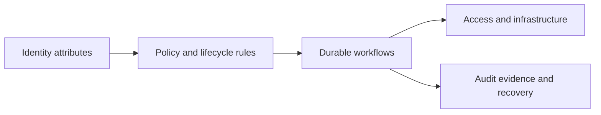

# Alice

**IT engineer building identity systems, automation, and reliable internal platforms.**

I turn recurring operational problems into systems that are easier to trust and cheaper to operate: explicit policy, safe defaults, observable workflows, and less manual work for the next person.

[LinkedIn](https://linkedin.com/in/alice-l-248502224)

## How I think in systems

| Identity & lifecycle | Automation & workflow | Cloud & platform |
| --- | --- | --- |
| Connect source-of-truth attributes to the access people need. | Replace click-driven repetition with reviewable, observable handoffs. | Build infrastructure that remains understandable as the workload grows. |

## Selected public work

### [Meshtastic Hardware Guide](https://github.com/RealEphemeralEuphoria/mesh-guide)

Independent hardware research in an offline-first, single-file web application. It brings device comparisons, radio constraints, power, antennas, sensors, and self-build paths into one field-friendly guide.

### [Dalamud Release Skill](https://github.com/RealEphemeralEuphoria/dalamud-release-skill)

Release automation for FFXIV plugins that computes manifest metadata, preserves intentionally small diffs, and makes stable, testing, and promotion workflows repeatable.

## Current focus

I am experimenting with Terraform-managed Okta configuration so identity changes can move from click-driven wizards toward reviewable code. Recent platform work has included AWS Lambda, Kubernetes, Terraform, Terragrunt, and Temporal workflows.

I also deployed Hindsight on Kubernetes to give an internal team shared context across AI workflows, and I build local-first memory and session-continuity tooling in my homelab.

<strong>Platform toolkit</strong>

Identity: Okta · Workspace ONE · Google Workspace · Slack 
Automation: Python · PowerShell · REST APIs · Temporal 
Infrastructure: AWS · Kubernetes · Terraform · Terragrunt · Docker · PostgreSQL

